# XYGrid Nodes for InvokeAI (V3.4+ only)

Discord link:- [XYImage To Grid](https://discord.com/channels/1020123559063990373/1133465385182699582)

Thanks To:<BR>
@dwringer and @JPPhoto for many hours of testing and support during the development of the tiled scaling workflows and associated nodes.<BR>
@JPPhoto for creating most of the smart seam code and also the `Minimum Overlap` version of the Tile Generator.<BR>
@Jaid for the PR to add the `Percentage To Float` node and inspiration for improving and reworking the sorting to handle it.<BR>

## Overview

These nodes add the following to InvokeAI:
- Generate grids of images from multiple input images
- Create XY grid images with labels from parameters
- Split images into overlapping tiles for processing (for super-resolution workflows)
- Recombine image tiles into a single output image blending the seams 

The nodes include:
- [Images To Grids](#images-to-grids-node): combine multiple images into a grid of images
- [XYImages To Grid](#xyimages-to-grids-node): Take X & Y params and create a labeled image grid.
- [XYImage Tiles](#xyimage-tiles-nodes): Super-resolution (embiggen) style tiled resizing
- [Image To XYImages](#image-to-xyimages-node) 
- [Supporting nodes](#supporting-nodes)


## Usage

### Install

There are two options to install the nodes:

1. **Recommended**: Use Git to clone the repo into the `invokeai/nodes` directory. This allows updating via `git pull`.

    - In the InvokeAI nodes folder, run:

        ```bash
        git clone https://github.com/skunkworxdark/XYGrid_nodes.git
        ```

2. Manually download [images_to_grids.py](images_to_grids.py) & [__init__.py](__init__.py) then place them in a subfolder under `invokeai/nodes`.  

**Important:** If you have a previous version of these nodes (pre-Invoke 3.4) installed in `.env`, delete the old `images_to_grids.py` to avoid errors. Existing workflows may need updating due to node name and parameter changes. See included workflows for examples.

### Update

Run a `git pull` from the `XYGrid_nodes` folder.

Or run `update.bat` or `update.sh`.

For manual installs, download and replace the files.

### Remove

Delete the `XYGrid_nodes` folder. Or rename it to `_XYGrid_nodes` so InvokeAI will ignore it.


## Known issues
- `Images To Grids` output images don't automatically appear onscreen on a board.
  - Refresh the browser or force the board to load more images.
  - Or add iterate and show/save image nodes to the output of the `Images To Grids` node.
- Image generation will stop will stop with an invalid scheduler name.

## TODO
- Fix the `Images To Grids` node output not automatically appearing onscreen in the board without workarounds
- Add other types to string and string to types conversions for other parameters e.g.  Model, Lora, images etc...
- Create a useable way to select multiple things from a list (checkbox selection) to enable selecting things from lists like models and Loras etc

## Example workflows
Example workflows are in the [workflows](workflows) folder.
- [i2g_rndRange_wf.json](workflows/i2g_rndRange_wf.json): Basic Images to Grids workflow using a Random Range
- [xygrid_csv-prompt-cfg_wf.json](workflows/xygrid_csv-prompt-cfg_wf.json): XY Grid workflow example using Prompt joining and CFG Scale via CSV values
- [xygrid_csv-step-cfg_wf.json](workflows/xygrid_csv-step-cfg_wf.json): XY Grid workflow example using Step and CFG Scale via CSV values
- [xygrid_csv-step-scheduler_wf.json](workflows/xygrid_csv-step-scheduler_wf.json): XY Grid workflow example using Step and Scheduler CSV values
- [xygrid_range-step-cfg_wf.json](workflows/xygrid_range-step-cfg_wf.json): XY Grid workflow example using Step and CFG Scale via Integer and Float ranges
- [xyi_tile_default_wf.json](workflows/xyi_tile_default_wf.json): XYImage Tile scaling + default tile generator
- [xyi_tile_even-split_wf.json](workflows/xyi_tile_even-split_wf.json): XYImage Tile scaling + even split tile generator
- [xyi_tile_min-overlap_wf.json](workflows/xyi_tile_min-overlap_wf.json): XYImage Tile scaling + minimum overlap tile generator
- [xyi_tile_default_globalnoise_wf.json](workflows/xyi_tile_default_globalnoise_wf.json): XYImage Tile scaling + default tile generator + globalnoise
- [xyi_tile_even-split_globalnoise_wf.json](workflows/xyi_tile_even-split_globalnoise_wf.json): XYImage Tile scaling + even split tile generator + globalnoise
- [xyi_tile_min-overlap_globalnoise_wf.json](workflows/xyi_tile_min-overlap_globalnoise_wf.json): XYImage Tile scaling + minimum overlap tile generator + globalnoise
- [i2xyi_scale_wf.json](workflows/i2xyi_scale_wf.json): Image To XYImage basic workflow simple scaling


## Main Nodes  
### `Images To Grids` node
Creates image grids from a collection of input images. Multiple image grids are created if more images than fit in one.
<details><summary>Details</summary>
<details><summary>Workflow Example</summary>

[i2g_rndRange_wf.json](workflows/i2g_rndrange_wf.json)

</details>

<details><summary>Output Example</summary>

Grid-1:

Grid-2:
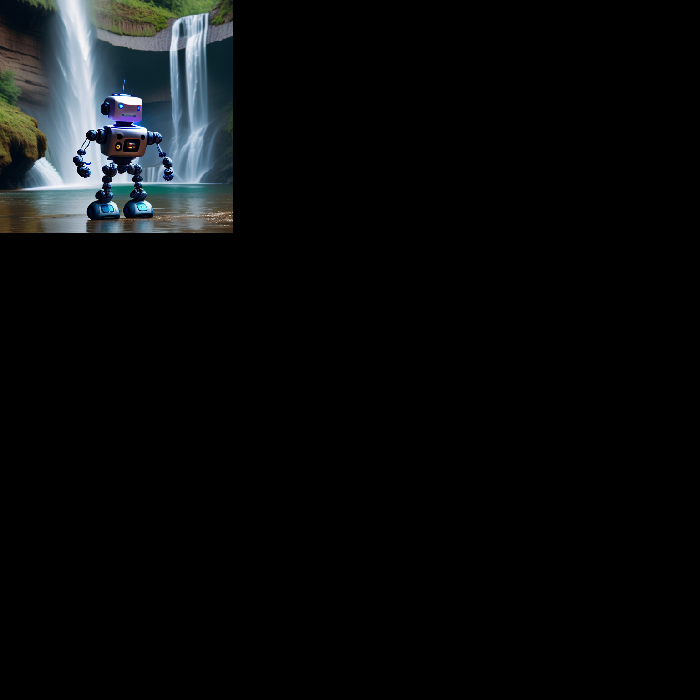
</details>

<details><summary>Node</summary>

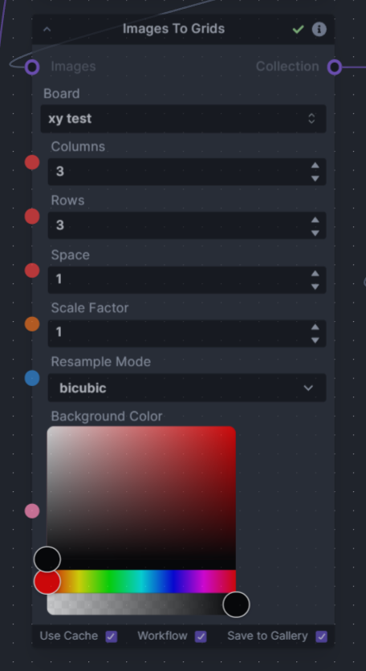
</details>

<details><summary>Inputs</summary>

- `Board`: Board to save images
- `Images`: Input images
- `Columns`: Images per row
- `Rows`: Rows per grid
- `Space`: Space between images
- `Scale Factor`: Resize amount
- `Resample Mode`: Resize method
- `Background Color`: Grid background color
</details>
</details>

<HR>

### `XYImages To Grids` node
Converts an `XYImages` collection into a labeled image grid. The `XYImages` collection is built using the supporting nodes.
<details><summary>Details</summary>
<details><summary>Workflow Examples</summary>

[xygrid_csv-prompt-cfg_wf.json](workflows/xygrid_csv-prompt-cfg_wf.json)
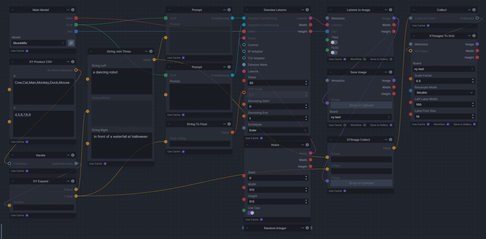

[xygrid_csv-step-cfg_wf.json](workflows/xygrid_csv-step-cfg_wf.json)
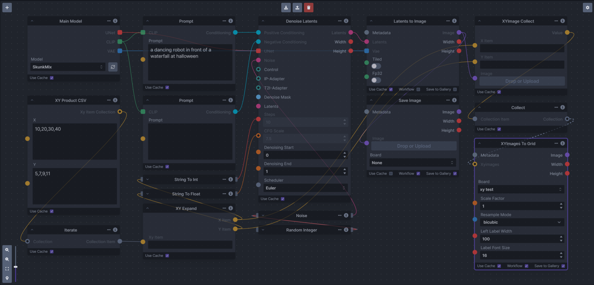

[xygrid_csv-step-scheduler_wf.json](workflows/xygrid_csv-step-scheduler_wf.json)
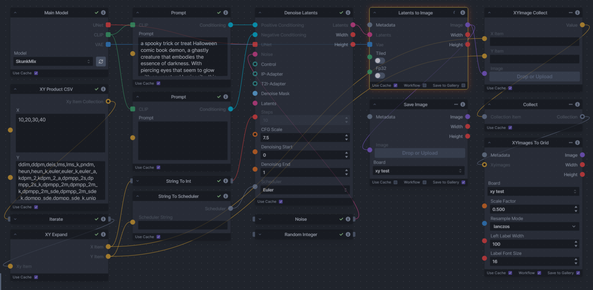

[xygrid_range-step-cfg_wf.json](workflows/xygrid_range-step-cfg_wf.json)

</details>

<details><summary>Output Examples</summary>

xygrid_csv-prompt-cfg_example<br>

xygrid_csv-step-cfg_example<br>

xygrid_csv-step-scheduler_example<br>

xygrid_range-step-cfg_example<br>

</details>

<details><summary>Node</summary>

</details>

<details><summary>Inputs</summary>

- `Board`: Board to save
- `XYImages`: `XYImage Item` collection. Created by `XYImage Collect` node fed into a `Collect` node
- `Scale Factor`: Image resize amount
- `Resample Mode`: Resize method
- `Left Label Width`: Label column width
- `Label Font Size`: Label font size
</details>
</details>

<HR>

### `XYImage Tiles` nodes

These nodes are designed to work together in a workflow. They allow you to split an image into tiles, process them, and then recombine them into an image.

- `Default XYImage Tile Generator`: Default version of a tile generator
- `Even Split XYImage Tile Generator`: Even Split version of a tile generator
- `Minimum Overlap XYImage Tile Generator`: Minimum Overlap  version of a tile generator
- `Image To XYImage Tiles`: Cuts input image into overlapping image tiles. Input from a tile generator node
- `XYImage Tiles To Image`: Merges tiles into a single image, blending the overlapping areas.
- `Crop Latents`: cuts a section from a latent image (Used in the global noise versions of example workflows)

The advantage of these nodes is that they enable you to work with larger images than usual by dividing them into smaller tiles, applying transformations, and stitching them back together. The nodes can also create overlapping tiles to improve consistency between tiles, and then blend the overlaps when reconstructing the image.
<BR><BR>
These nodes are not very intuitive to use, so I recommend checking out the example workflow and experimenting with it.

<details><summary>Details</summary>

The best use case is to create a super-resolution effect, similar to Invoke's old Embiggen or Automatic1111's Super Resolution. This is done with the help of the Tile controlnet to regenerate each tile at a higher resolution, and then recombine them into a much larger image. You can also try other image control methods, but the Tile controlnet seems to produce the most consistent results. You can also use no prompts at all and still get an OK image, but using the input image's original generation settings and prompts will generally give more consistent results.<BR>

### Tile Generators
These take an image and output a `Tiles` structure (xy cords of the tiles) to cut the image into smaller tiles.<BR>

This Tiles structure can then be passed onto the `Image To XYImage Tiles` node to do the actual tile cutting of an image.

#### `Default XYImage Tile Generator`
Default Tile Generator
- If the tiles don't divide perfectly into the source image then a final tile is created starting at the right edge of the image. This means that the last tile and row of tiles can have a larger overlap unless you choose a tile size and overlap carefully.
#### `Even Split XYImage Tile Generator`
Even Split Tile Generator
- Takes a number of tiles and an overlap value (tile Percentage) and produces evenly sized tiles and overlaps that automatically remain as multiples of 8. (Multiples of 8 are needed for image generation reasons)
#### `Minimum Overlap XYImage Tile Generator`
Minimum Overlap Tile Generator
-Keeps tiles at a fixed size but adjusts the overlap to be even across the image but always above the minimum.

<HR>

### `Image To XYImage Tiles`
Takes a `Tiles` structure as input and cuts up an image into multiple tiles.  Outputting in an `XYImages` collection. This is then fed into an `iterate` node and fed into an `XYImage Expand` so each tile can be processed individually.

<HR>

### `XYImage Tiles To Image` 
This takes an `XYImages` collection as output from `XYImage Collect` -> `Collect` nodes and recombines them blending the overlap areas and producing a single image. The result is a smooth and seamless image that preserves the details of each tile. It uses the X & Y parameters as coordinates to reconstruct the image.<BR>
You have Linear and Smart blend modes.
- Linear just blends the whole overlapping area from neighboring tiles. 
- Smart tries to find an ideal path between tiles and blurs then together on this. The Blur value is used to adjust how large an area is blended.

<HR>

<details><summary>Workflow Example</summary>

- [xyi_tile_default_wf.json](workflows/xyi_tile_default_wf.json): XYImage Tile scaling + default tile generator
- [xyi_tile_even-split_wf.json](workflows/xyi_tile_even-split_wf.json): XYImage Tile scaling + even split tile generator
- [xyi_tile_min-overlap_wf.json](workflows/xyi_tile_min-overlap_wf.json): XYImage Tile scaling + minimum overlap tile generator
- [xyi_tile_default_globalnoise_wf.json](workflows/xyi_tile_default_globalnoise_wf.json): XYImage Tile scaling + default tile generator + globalnoise
- [xyi_tile_even-split_globalnoise_wf.json](workflows/xyi_tile_even-split_globalnoise_wf.json): XYImage Tile scaling + even split tile generator + globalnoise
- [xyi_tile_min-overlap_globalnoise_wf.json](workflows/xyi_tile_min-overlap_globalnoise_wf.json): XYImage Tile scaling + minimum overlap tile generator + globalnoise
</details>

<details><summary>Output Example</summary>

Input:


2X Output:

</details>

<details><summary>Node Images</summary>

`Default XYImage Tile Generator`

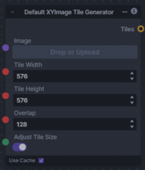

`Even Split XYImage Tile Generator`

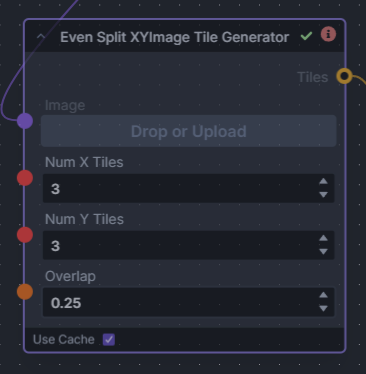

`Minimum Overlap XYImage Tile Generator`

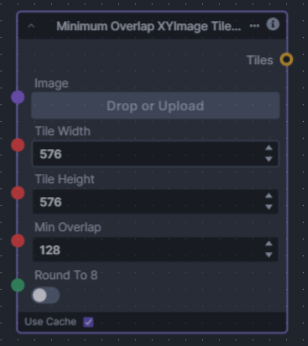

`Image To XYImage Tiles`


`XYImage Tiles To Image`

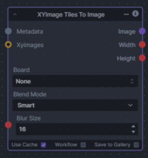

`Crop Latents`

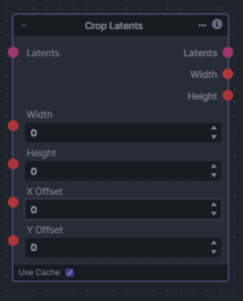

</details>


<details><summary>Inputs</summary>

`Default XYImage Tile Generator`
- `Image`: Input Image
- `Tile Width`: Width of the tile to cut
- `Tile Height`: Height of the tile to cut
- `Overlap`: Overlap to use for each tile

`Even Split XYImage Tile Generator`
- `Image`: Input Image
- `Num X Tiles`: The number of tiles to split the image into on the X-axis
- `Num Y Tiles`: The number of tiles to split the image into on the Y-axis
- `Overlap`: Overlap amount of the tile (0..1)

`Minimum Overlap XYImage Tile Generator`
- `Image`: Input Image
- `Tile Width`: Width of the tile to cut
- `Tile Height`: Height of the tile to cut
- `Min Overlap`: Minimum Overlap to use for each tile

`Image To XYImage Tiles`
- `Tiles`: Tiles structure output by a tile generator

`XYImage Tiles To Image`
- `XY Images`: `XYImage` collection. This comes from feeding the X & Y outputs of the `XYImage Expand` node and the regenerated tile image into the `XYImage Collect` node and then into a `Collect` node.
- `Board`: Board to save to
- `Blend Mode`: Linear or Smart
- `Blur Size`: Blur sized used with Smart blend

`Crop Latents`
- `Latents`: Latents to be cropped

</details>
</details>

<HR>

### `Image To XYImages` node
This is probably not a very useful node to most people. I created it for testing purposes while creating the Tile resize workflow. However, I have included it because someone might find a use for it.<BR>

It takes an image and cuts it up into a number of columns and rows. Then outputs an `XYImage` collection.  The X & Y items contain the X & Y coordinates of where it was cut from the input image.<BR>

It is the less useful baby brother of the `Image To XYImage Tiles` node as it doesn't do overlapping regions. If you wish to scale the images then the X & Y values will also have to be scaled before they can be recombined. I put together an example simple scaling workflow that isn't that useful but does demonstrate how it might be used.

<details><summary>Details</summary>
<details><summary>Workflow Examples</summary>

[i2xyi_scale_wf.json](workflows/i2xyi_scale_wf.json)
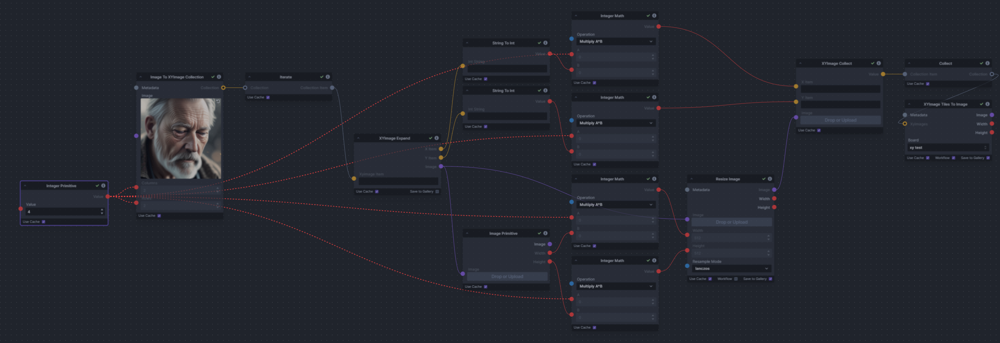</details>

<details><summary>Output Example</summary>

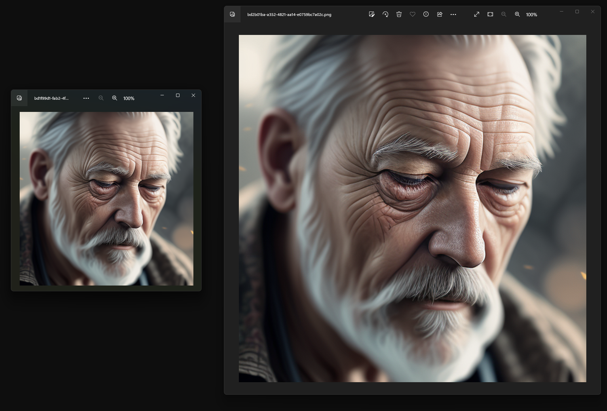</details>

<details><summary>Node</summary>

</details>

<details><summary>Input Descriptions</summary>

- `Image`: Input image
- `Columns`: Number of columns
- `Rows`: Number of rows
</details>
</details>


## Supporting Nodes
Helper nodes for data wrangling and building `XYImage` collections:

These nodes are used to create the `XY Item` and `XYImage` collections that drive the `XYImage To Grid` node.<BR>
The processing order is as follows `XY Data` -> `XY Product` or `XY Product CSV` -> `Iterate` -> `XY Expand` -> `Image Generation` -> `XY Image Collect` -> `Collect` -> `XYImages to Grid`

The best way to understand this is to look at the XYGrid workflow examples and play with them.

### XY Data Inputs and XY Product Nodes
These nodes provide ways of inputting and converting the X & Y data into a collection of strings that the `XY Product` node can use.
|Node|Description|
|-|-|
|`Floats To Strings`| Converts a Float or collections of Floats to a collection of strings.<BR> The intended use is to take a float collection from a `Float Range` node that can be passed into the `XY Product` node.|
|`Ints To Strings`| Converts an Integer or collection of Integers to a collection of strings.<BR> The intended use is to take an Integer collection from an `Integer Range` node that can be passed into the `XY Product` node.|
|`CSV To Strings`| Converts a CSV string to a collection of strings.<BR> The output of this is intended as input to the `XY Product` node. This splits the input string on every comma character and ignores any other CSV conventions like quoted strings|
|`XY Product`| Takes individual X & Y string collections and outputs the product of these (a collection that has every combination of X and Y) as an `XY Item` collection.<BR> This is then passed into an `iterate` node and each `XY Item` is then passed one at a time into an `XY Expand` node.|
|`XY Product CSV`| This is two `CSV To Strings` nodes and an `XY Product` node combined into a single node for convenience. Taking X & Y CSV strings and outputting the product of these as an `XY Item` collection.<BR> This is then passed into an `iterate` node and each combination is then passed one at a time into a `XY Expand` node.|

<details><summary>Node Example images</summary>


</details>

### XY Expand, XYImage Expand, Data Output & XY Image Collect nodes
These nodes provide a way of extracting the X and Y data from `XY` & `XYImage` collections and converting the string back into types. Also collecting the resulting Image and XY data to pass onto the `XYImages To Grid` or `XYImage Tiles To Image` nodes. 

|Node|Description|
|-|-|
|`XY Expand`|Extracts X & Y strings from an `XY Item` output of the `XY Product` -> `iterate` node.<BR> The X & Y outputs can be passed to the X & Y inputs of the `XYImage Collect` node and used as the labels for the `XYImage To Grid` node.<BR> The X & Y outputs can be used directly into node inputs that accept strings e.g. Prompt, String Join etc... However, before being used as input to other nodes they will need to be converted into the correct type. This can be done with the `String To Float` and `String To Int` nodes|
|`XYImage Expand`|This is used as part of an `XY Image Tile` workflow. It extracts the X, Y & Image tile from an `XYImage Item` output of the `Image To XYImage Tile` -> `iterate` node.<BR>  The X & Y outputs **MUST** be passed to X & Y inputs of the `XYImage Collect` node as is to ensure the recombination works.<BR> The Image output is used with a `Tile` controlnet (or similar method) to generate a new up-scaled Image Tile. These are then also passed into the `XYImage Collect` node and then finally onto the `XYImage Tile To Image` node.|
|`Percent To Float`|Converts a string to a float and divides it by 100. This is useful for instances where you want to define a fraction as a percentage. Ths could be used used as input by nodes that accept the float but especially ones that expect a fraction like Denoise start/end etc...|
|`String To Float`|Converts a string to a float. This is needed to convert the output of the `XY Expand` node before it can be used as input by nodes that accept the float data type e.g. CFG, Denoise start/end etc...|
|`String To Int`|Converts a string to an integer. This is needed to convert the output of the `XY Expand` node before it can be used as input by nodes that accept the integer data type e.g. Step, Width, Height etc....|
|`String To Scheduler`|Converts a string to a scheduler. This is needed to convert the output of the `XY Expand` node before it can be used as input by nodes that accept the scheduler data type.  Scheduler has to be provided as a string via a `CSV` and `string` based node in the internal name format.<BR> At the time of writing this can only be from the following values (ddim, ddpm, deis, lms, lms_k, pndm, heun, heun_k, euler, euler_k, euler_a, kdpm_2, kdpm_2_a, dpmpp_2s, dpmpp_2s_k, dpmpp_2m, dpmpp_2m_k, dpmpp_2m_sde, dpmpp_2m_sde_k, dpmpp_sde, dpmpp_sde_k, unipc) if in the future these are added to then the list can be found in the core schedulers.py file|
|`XYImage Collect`|The job of this node is to collect the generated Images and the X & Y items in a single place so they can be passed onto the `Collect` node and then onto the `XYImage To Grid` or `XYImage Tile To Image` nodes.|

<details><summary>Node Example images</summary>

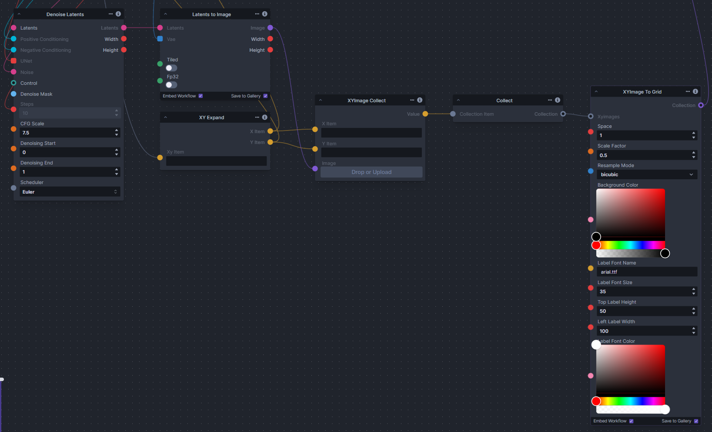

</details>

